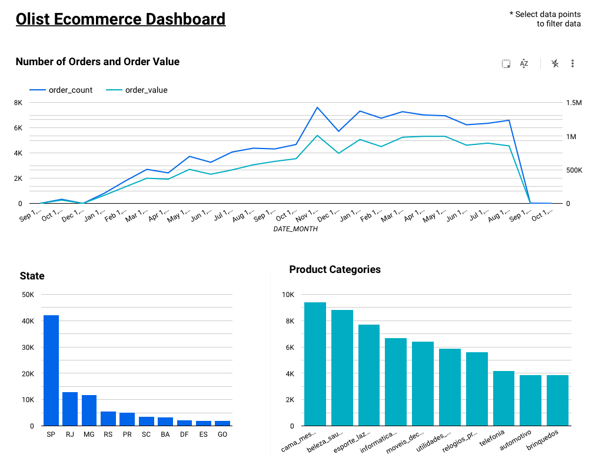

# Problem Statement
[This dataset from Kaggle](https://www.kaggle.com/datasets/olistbr/brazilian-ecommerce) provides information of orders made at [Olist Store](https://olist.com/pt-br/), a Brazilian Ecommerce, from 2016 to 2018. 

In this project, we will build a data pipeline to ingest and process the data, and eventually visualise the data in Google Bigquery.
find out the states with the most number of orders made and the daily volume of orders from these states.


# Dashboard
https://datastudio.google.com/reporting/216f796f-e212-4d7f-bdbb-6ff6a5877761



# Running the project
Setup
Refer to this [video](https://www.youtube.com/watch?v=Hajwnmj0xfQ&list=PL3MmuxUbc_hJed7dXYoJw8DoCuVHhGEQb&index=12) for Terraform and GCP setup

Using Terraform to setup GCP resources
```bash
cd terraform
terraform init
terraform plan
terraform apply
terraform destroy (to remve resources once done)
```

Running Airflow
```bash
docker-compose up
```


### Data ingestion by DAG
Run the following DAGs in sequence to generate the necessary tables

1. ingest_olist_dag - Download data from source and upload to GCS
2. gcs_to_bq_dag - Copy data from GCS to Bigquery
3. bq_transformation_dag - Aggregated table storing transformations to improve dashboard query performance 


# Technologies used
- Terraform
- Docker
- Airflow
- Google Cloud Storage
- Google Bigquery
- Google Data Studio


# Tables
We have used Airflow to orchestrate the ingestion of data to GCS and moving the data to Google Bigquery.


# Acknowledgement
I am very grateful to the following instructors who have spent a great amount of time and effort to put together the materials at [Data Engineering Zoomcamp](https://github.com/DataTalksClub/data-engineering-zoomcamp)

- Ankush Khanna (https://linkedin.com/in/ankushkhanna2)
- Sejal Vaidya (https://linkedin.com/in/vaidyasejal)
- Victoria Perez Mola (https://www.linkedin.com/in/victoriaperezmola/)
- Alexey Grigorev (https://linkedin.com/in/agrigorev)
